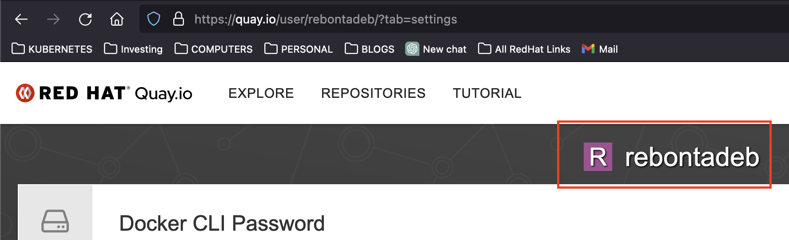
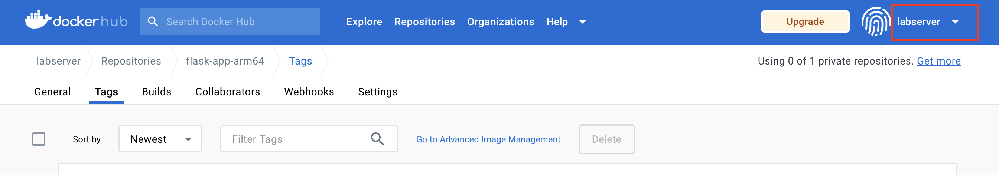

# PODMAN PUSH

## Push the existing tagged image with a new tag of your own repository.
```
podman push quay.io/basics/my-sample-app:v1 
```

Here `basics` is the username of remote repository. 
In this case check the username from your personal remote repository `quay.io` 


or `docker.io`

